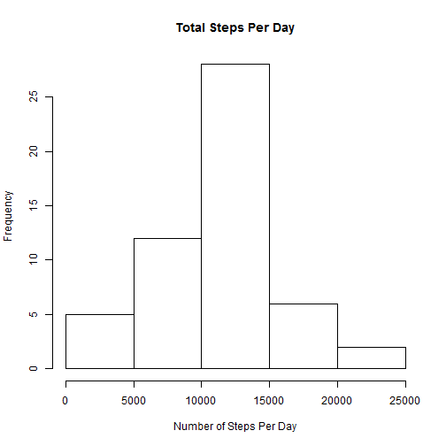
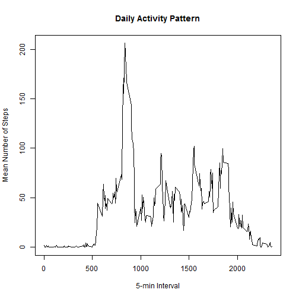
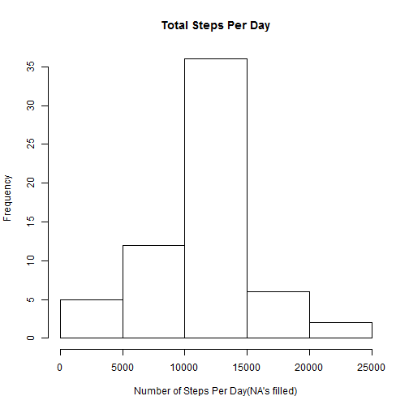

# Assignment 1, Coursera: Reproducible Research

# Data  
The data for this assignment can be downloaded from the course web site:  
* Dataset: [Activity monitoring data](https://d396qusza40orc.cloudfront.net/repdata%2Fdata%2Factivity.zip) (52K)

The variables included in this dataset are:  
* **steps**: Number of steps taken in a 5-minute interval (missing values are coded as `NA`)  
* **date**: The date on which the measurement was taken in YYYY-MM-DD format  
* **interval**: Identifier for the 5-minute interval in which measurement was taken 


## Loading and preprocessing the data
Read in the activity.csv file:

```r
  data <- read.csv("activity.csv")
```

Convert dates to Date type:

```r
data$date <- as.Date(data$date, "%Y-%m-%d")
```

## What is mean total number of steps taken per day?
Calculate steps-per-day:

```r
stepsPerDay <- aggregate(steps ~ date, data=data, sum)
```

## display histogram of total steps per day

```r
hist(stepsPerDay$steps,
  main = "Total Steps Per Day",
  xlab = "Number of Steps Per Day")
```

 

Calculate and report the **mean** and **median** total number of steps taken per day:

```r
meanPerDay <- round(mean(stepsPerDay$steps))
medianPerDay <- round(median(stepsPerDay$steps))
```

The **mean** total number of steps per day is 1.0766 &times; 10<sup>4</sup>.  
The **median** total number of steps per day is 1.0765 &times; 10<sup>4</sup>.

## What is the average daily activity pattern?
Find mean steps for each interval:

```r
meanPerInterval <- aggregate(steps ~ interval, data=data, mean)
```

Make a time series plot (i.e. `type = "l"`) of the 5-minute interval (x-axis) and the average number of steps taken, averaged across all days (y-axis).  

```r
plot(meanPerInterval$interval, meanPerInterval$steps, type="l",
     xlab="5-min Interval", ylab="Mean Number of Steps",
     main="Daily Activity Pattern")
```

 

Which 5-minute interval, on average across all the days in the dataset, contains the maximum number of steps?  

```r
maxInterval <- meanPerInterval$steps==max(meanPerInterval$steps)
meanPerInterval[maxInterval,]$interval
```

```
## [1] 835
```

## Imputing missing values
Calculate and report the total number of missing values in the dataset (i.e. the total number of rows with `NA`s):

```r
numOfNA < sum(is.na(dtat.steps))
```

```
## Error: object 'numOfNA' not found
```

```r
numOfNA
```

```
## Error: object 'numOfNA' not found
```

Devise a strategy for filling in all of the missing values in the dataset. The strategy does not need to be sophisticated. For example, you could use the mean/median for that day, or the mean for that 5-minute interval, etc.


Take mean of a 5-minute interval and use that to fill in `NA` values

```r
## find rows with NA values
hasNa <- grep(TRUE, is.na(data$steps))

## make copy of data to preserve original data
naFilledData <- data

## replace NA values with means
for (i in hasNa)
  {
    naFilledData[i,]$steps <- 
      meanPerInterval[meanPerInterval$interval ==
                        naFilledData[i,]$interval,]$steps
  }
```

Calculate steps-per-day:

```r
naFilledStepsPerDay <- aggregate(steps ~ date, data=naFilledData, sum)
```


display histogram of total steps per day

```r
hist(naFilledStepsPerDay$steps,
  main = "Total Steps Per Day",
  xlab = "Number of Steps Per Day(NA's filled)")
```

 

Calculate and report the **mean** and **median** total number of steps taken per day:

```r
naFilledMeanPerDay <- round(mean(naFilledStepsPerDay$steps))
naFilledMedianPerDay <- round(median(naFilledStepsPerDay$steps))
```

**Mean** number of steps per day: 1.0766 &times; 10<sup>4</sup>.  
**Median** number of steps per day: 1.0766 &times; 10<sup>4</sup>.

Do these values differ from the estimates from the first part of the assignment?

Caluclate difference between filled & non-filled data:

```r
meanDiff <- naFilledMeanPerDay - meanPerDay
medianDiff <- naFilledMedianPerDay - medianPerDay
meanDiff
```

```
## [1] 0
```

```r
medianDiff
```

```
## [1] 1
```

What is the impact of imputing missing data on the estimates of the total daily number of steps?

There is about a one hundredth of one percent difference in the estimates, this is not significant in this case.

## Are there differences in activity patterns between weekdays and weekends?

Create a new factor variable in the dataset with two levels - "weekday" and "weekend" indicating whether a given date is a weekday or weekend day.  

```r
## create new factor
naFilledData$weekday <- weekdays(naFilledData$date)
naFilledData$group <- "weekday"

## Seperate out Saturday and Sunday as weekend
filter <- grep("^S", naFilledData$weekday)
naFilledData[filter,]$group <- "weekend"
```

Make a panel plot containing a time series plot (i.e. `type = "l"`) of the 5-minute interval (x-axis) and the average number of steps taken, averaged across all weekday days or weekend days (y-axis).

```r
## create plot data
facetPlot <- aggregate(steps ~ group + interval, data=naFilledData, mean)

## load ggplot2 library and create plot graphic
library(ggplot2)
qplot(interval,
      steps,
      data=facetPlot,
      geom="line",
      facets=group ~ .)
```

 
